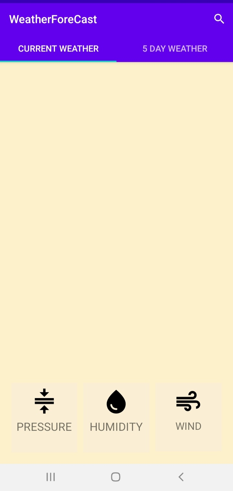
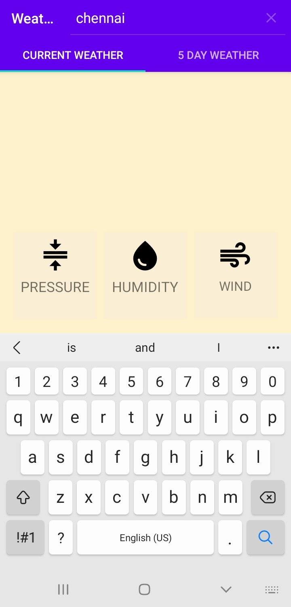
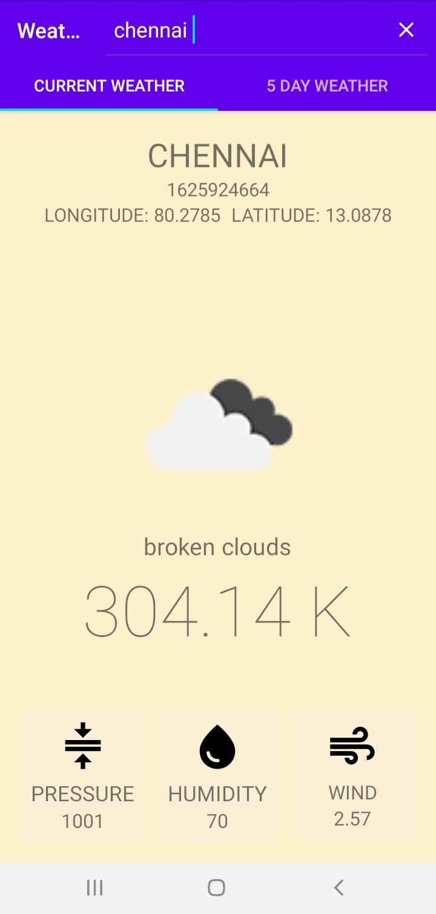
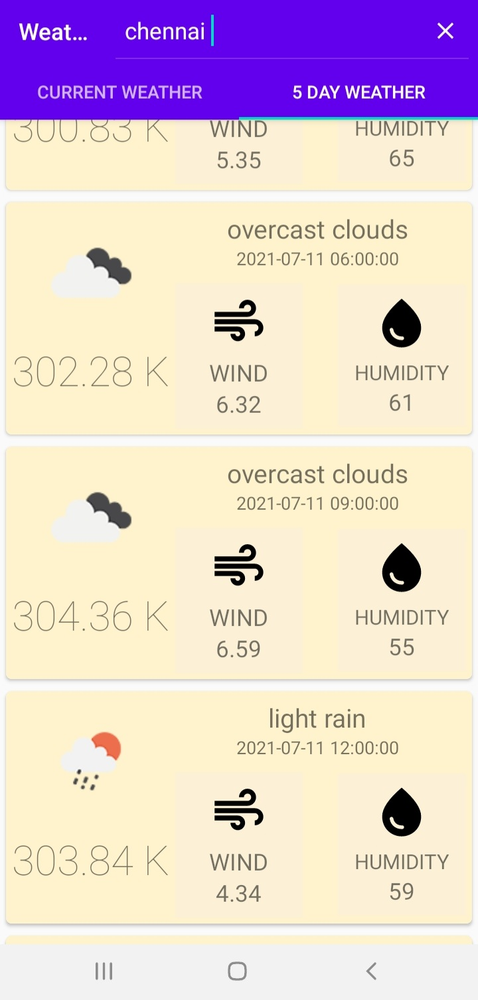

### WEATHER FORECAST
Displays weather data of state/country searched
#### Screenshots
<table>
    <tr>
        <td></td>
        <td></td>
        <td></td>
        <td></td>
    </tr>
</table>

#### Features
1. Current weather
2. 5 Day weather report
#### Libraries
1. Volley
2. Picasso
#### API
1. openweathermap API for weather data
